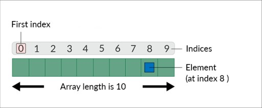

# Array
Массив — это объект-контейнер, который содержит фиксированное количество значений одного типа. Длина массива устанавливается при его создании. После создания его длина фиксируется.

**Устройство в памяти:**
В Java массивы представлены как объекты, хранящие элементы в последовательной памяти. Элементы массива располагаются друг за другом, и доступ к ним осуществляется по индексам. Каждый элемент массива занимает фиксированное количество байтов, которое зависит от типа данных, хранимого в массиве. Массивы также хранят информацию о своей длине.

**Интерфейс структуры:**
В Java массивы имеют следующий интерфейс структуры:
1. Длина массива определяется при его создании и остается неизменной в течение всего его существования.
2. Элементы массива доступны по индексам, начиная с 0.
3. Массивы могут быть одномерными и многомерными (массивами массивов).
4. Массивы могут содержать элементы примитивных типов данных или ссылки на объекты.

**Плюсы массивов:**
1. Эффективный доступ к элементам по индексам, что делает их быстрыми для чтения и записи данных.
2. Фиксированный размер, что может быть полезным, если требуется хранить фиксированное количество элементов.

**Минусы массивов:**
1. Фиксированный размер: размер массива задается при создании и не может изменяться. Если требуется динамическое управление размером коллекции, то массивы не подходят.
2. Отсутствие встроенных методов для удобного выполнения операций над данными (например, сортировки или фильтрации).
3. Массивы не могут содержать элементы разных типов (если это не массивы объектов).
4. Управление памятью: вам нужно самостоятельно следить за выделением и освобождением памяти для массивов.

**Где можно использовать:**
Массивы могут быть полезными в следующих случаях:
1. Когда требуется хранить фиксированное количество элементов одного типа данных и основной операцией является доступ по индексу.
2. В алгоритмах, где производительность является критическим фактором, и требуется эффективный доступ к данным.

**Где не рекомендуется использовать:**
1. Когда требуется динамическое изменение размера коллекции. Вместо массивов лучше использовать динамические структуры данных, такие как `ArrayList` или `LinkedList`.
2. Если вам нужны разнородные типы данных, вместо массивов следует использовать коллекции объектов.
3. В случаях, когда требуется более высокоуровневая функциональность (например, фильтрация, сортировка и т. д.), лучше воспользоваться библиотеками для работы с коллекциями, такими как Java Streams API.
