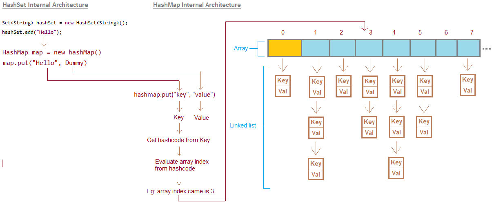

# Hash collections

Коллизия hash - совпадение результата функции `hashCode()`

Алгоритм, который преобразует данные в хеш фиксированного размера, называется алгоритмом хеширования. Алгоритм хеширования в Java — это криптографическая хэш-функция. Хэш-алгоритм или хеш-функция спроектированы таким образом, что ведут себя как односторонняя функция . Один способ означает, что невозможно выполнить инверсию, т. е. невозможно получить исходное значение из хеша.

***Хороший алгоритм хеширования должен обладать следующими характеристиками:***
- Алгоритм хеширования должен быть достаточно быстрым, чтобы хешировать любые данные.
- Алгоритм должен избегать регенерации сообщения из его сгенерированного хеш-значения (в одну сторону).
- Два сообщения не должны иметь одинаковый хеш в любой момент времени. Другими словами, алгоритм хеширования должен избегать коллизий.
- Хэш-значение сообщения должно измениться даже при незначительном изменении сообщения. Это явление известно как лавинный эффект.

# HashMap

Класс Java HashMap реализует интерфейс Map, который позволяет нам хранить пару ключ-значение, где ключи должны быть уникальными. Если вы попытаетесь вставить дубликат ключа, он заменит элемент соответствующего ключа. Используя индекс ключа, легко выполнять такие операции, как обновление, удаление и т. д. Класс HashMap находится в пакете java.util .

HashMap в Java похож на устаревший класс Hashtable, но он не синхронизируется. Это также позволяет нам хранить нулевые элементы, но должен быть только один нулевой ключ. Начиная с Java 5, он обозначается как HashMap<K,V> , где K означает ключ, а V — значение. Он наследует класс AbstractMap и реализует интерфейс Map.

При коллизии элементы собираются в LinkedList в порядке добавления, это можно заметить на скрине ниже (1, 3, 4, 5)

- Java HashMap содержит значения, основанные на ключе.
- Java HashMap содержит только уникальные ключи.
- Java HashMap может иметь один нулевой ключ и несколько нулевых значений.
- Java HashMap не синхронизирован.
- Java HashMap не поддерживает порядок.
- Начальная емкость класса Java HashMap по умолчанию равна 16 с коэффициентом загрузки 0,75.

**HashMap vs HashTable**
- **HashMap не синхронизирован.** Он не является потокобезопасным и не может использоваться несколькими потоками без надлежащего кода синхронизации. Хэш-таблица синхронизирована. Она потокобезопасена и может использоваться многими потоками.
- Мы можем сделать HashMap синхронизированным, вызвав этот код `Map m = Collections.synchronizedMap(hashMap);`. Хэш-таблица внутренне синхронизирована и не может быть рассинхронизирована.
- HashMap — это новый класс, представленный в JDK 1.2.	HashTable — устаревший класс.
- HashMap работает быстро. HashTable работает медленно.
- HashMap наследует класс AbstractMap. HashTable наследует класс Dictionary.

[HashMap vs HashTable. Подробнее...](https://www.javatpoint.com/difference-between-hashmap-and-hashtable)

# LinkedHashMap

LinkedHashMap очень похож на HashMap, но имеет дополнительную функцию сохранения порядка вставленного элемента. HashMap предоставляет простой способ вставки, удаления и поиска элементов, но не обеспечивает никакого способа поддерживать и отслеживать порядок вставленных элементов. Здесь на сцену выходит LinkedHashmap, который решает эту проблему.

Класс LinkedHashMap является альтернативой классу HashMap. Он очень похож на класс HashMap. Поскольку он наследует класс HashMap, он содержит все свойства и методы класса HashMap. Кроме того. Он обеспечивает простой способ поддерживать порядок элементов. LinkedHashMap наследует класс HashMap и реализует интерфейс Map.

**LinkedHashMap vs HashMap**

LinkedHashMap — это альтернатива HashMap с некоторыми дополнительными функциями. Ниже приведены некоторые основные различия между LinkedHashMap и HashMap:

- Основное различие между HashMap и LinkedHashMap заключается в порядке элементов. LinkedHashMap позволяет упорядочивать и отслеживать элементы. Для сравнения: HashMap не поддерживает упорядочивание элементов. В LinkedHashMap, если мы перебираем элемент, мы получим ключ в том порядке, в котором элементы были вставлены.
- HashMap и LinkedHashMap допускают только один нулевой ключ и несколько значений.
- HashMap расширяет класс AbstractMap и реализует интерфейс Map, тогда как LinkedHashMap расширяет класс HashMap и реализует интерфейс Map.
- И LinkedHashMap, и HashMap не синхронизированы, но их можно синхронизировать с помощью метода Collections.synchronizedMap().
- HashMap использует сегмент для хранения элементов, который является индексом массива, например, Bucket0 означает индекс [0], Bucket1 означает индекс [1] и т. д. массива. Принимая во внимание, что LinkedHashMap использует ту же внутреннюю реализацию, что и HashMap, но, кроме того, он также использует двойную связь между всеми своими записями. Этот связанный список полезен для упорядочивания элементов.
- HashMap требует меньше памяти, чем LinkedHashMap; поскольку LinkedHashMap использует тот же процесс реализации, что и HashMap; кроме того, он использует двойной LinkedList для поддержания порядка элементов.
- И LinkedHashMap, и HashMap обеспечивают одинаковую производительность.
