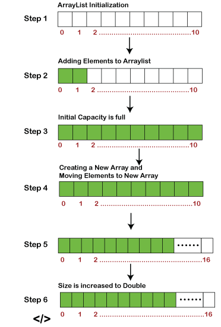
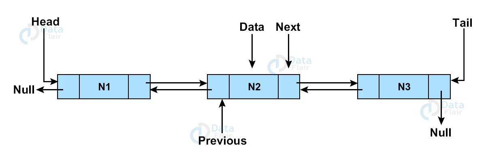
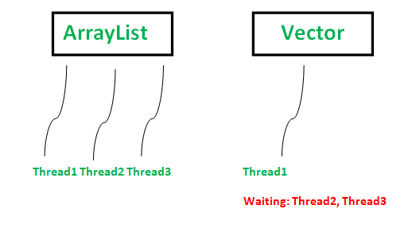

# ArrayList

**ArrayList vs Array**
- Array имеет статический размер. ArrayList имеет динамический размер.
- Array представляет собой структуру данных фиксированной длины. ArrayList — это структура данных переменной длины . При необходимости его размер можно изменить самостоятельно.

[ArrayList vs Array. Подробнее...](https://www.javatpoint.com/difference-between-array-and-arraylist#:~:text=An%20array%20is%20a%20fixed,be%20resized%20itself%20when%20needed.&text=It%20is%20mandatory%20to%20provide,initializing%20it%20directly%20or%20indirectly.)

**Когда использовать ArrayList:**
- **Произвольный доступ:** ArrayList обеспечивает позиционный доступ в постоянное время, что делает его отличным выбором, когда вам нужно часто обращаться к элементам через их индексы.
- **Эффективные операции Get и Set.** Операции get(int index) и set(int index, E element) весьма эффективны в ArrayList, поскольку они напрямую обращаются к элементу в базовом массиве на основе индекса.
- **Добавление элементов в конец:** ArrayList хорошо подходит, когда элементы добавляются или удаляются преимущественно в конце списка, поскольку эти операции выполняются с постоянным временем.

Однако следует соблюдать осторожность при добавлении или удалении элементов в середине ArrayList. Такие операции могут быть дорогостоящими, поскольку они предполагают перемещение последующих элементов для поддержания непрерывности списка.

# LinkedList

LinkedList — это реализация двусвязного списка интерфейсов List и Deque. Это позволяет эффективно вставлять или удалять элементы с обоих концов, но индексированный доступ может потребовать обхода списка.

**LinkedList vs ArrayList**
- ArrayList внутри использует динамический массив для хранения элементов. LinkedList внутри использует двусвязный список для хранения элементов. Если быть точным, ArrayList — это массив изменяемого размера. LinkedList реализует двусвязный список интерфейса списка.
- Манипуляции с ArrayList выполняются медленно, поскольку внутри него используется массив. Если какой-либо элемент удаляется из массива, все остальные элементы смещаются в памяти.	Манипуляции с LinkedList выполняются быстрее, чем с ArrayList, поскольку он использует двусвязный список, поэтому сдвиг битов в памяти не требуется.
- ArrayList лучше подходит для хранения данных и доступа к ним. LinkedList лучше подходит для манипулирования данными.

[LinkedList vs ArrayList. Подробнее...](https://www.javatpoint.com/difference-between-arraylist-and-linkedlist)

**Когда использовать LinkedList:**
- **Добавление или удаление на обоих концах.** Если ваша программа часто добавляет или удаляет элементы с обоих концов, например, в очереди или двухсторонней очереди, LinkedList является подходящим выбором. Такие операции, как addFirst(E e), addLast(E e), RemoveFirst() и RemoveLast(), обычно имеют постоянное время в LinkedList.
- **Вставки и удаления в середине:** LinkedList полезен, когда вам приходится часто вставлять или удалять элементы из середины списка. Ссылки до и после узла можно корректировать, не затрагивая остальную часть списка и не смещая элементы, как в ArrayList.

Однако имейте в виду, что получение или установка элементов на основе их индекса в LinkedList может быть медленным, поскольку может потребоваться перемещение с начала или конца списка.

# Vector 

Вектор похож на ArrayList, поскольку он также реализует динамический массив для хранения элементов. Однако это устаревший класс из самых ранних версий Java, и он синхронизируется. Хотя это делает его потокобезопасным, оно также снижает производительность из-за накладных расходов на синхронизацию.

**Vector vs ArrayList**
- ArrayList не синхронизирован. Vector синхронизирован.
- ArrayList увеличивает 50% текущего размера массива, если количество элементов превышает емкость ts. Увеличение Vector на 100% означает увеличение размера массива вдвое, если общее количество элементов превышает его емкость.
- ArrayList не является устаревшим классом. Он представлен в JDK 1.2. Vector — это устаревший класс.
- ArrayList допускается несколько потоков. Vector разрешен только одн поток.

**Синхронизация**
Vector синхронизирован, что означает, что только один поток одновременно может получить доступ к коду, тогда как ArrayList не синхронизирован, что означает, что несколько потоков могут работать с ArrayList одновременно. Например, если один поток выполняет операцию добавления, то в многопоточной среде может быть другой поток, выполняющий операцию удаления. Если несколько потоков одновременно обращаются к ArrayList, мы должны синхронизировать блок кода, который структурно изменяет список или разрешает простые модификации элементов. Структурная модификация означает добавление или удаление элемента(ов) из списка. Установка значения существующего элемента не является структурной модификацией.

[Vector vs ArrayList. Подробнее...](https://www.geeksforgeeks.org/vector-vs-arraylist-java)

**Когда использовать вектор:**
- **Требуется потокобезопасность.** Если ваше приложение является многопоточным и требует потокобезопасных операций без внешней синхронизации, Vector может подойти. Его методы синхронизированы, что означает, что их можно безопасно использовать в многопоточной среде.
- **Устаревший код:** вектор также можно использовать при работе с устаревшим кодом, который уже использует его.

Однако в современной разработке Java использование Vector обычно не рекомендуется. Для потокобезопасных коллекций доступны лучшие альтернативы, такие как CopyOnWriteArrayList или коллекции, возвращаемые Collections.synchronizedList().

# Заключение
Выбор между ArrayList, LinkedList и Vector зависит от конкретных потребностей вашего приложения. Учитывайте такие факторы, как частота и расположение вставок и удалений, необходимость произвольного доступа и необходимость потоковой безопасности.
