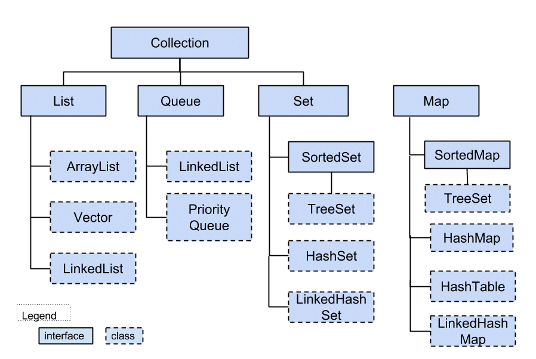

# Data structures in Java

Ниже приведен список некоторых распространенных типов структур данных в Java:

- [Array](array.md)
- Stack
- Heap
- Graph
- Dictionary (Map)
- Queue, PriorityQueue
- Dequeue, ArrayDequeue
- BinaryTree, BinarySearchTree, TreeMap
- [ArrayList, LinkedList, Vector](list.md)
- [TreeSet, HashSet, LinkedHashSet](set.md)
- [HashMap, LinkedHashMap, HashTable](hash.md)

#### Data structure diagram

В чем разница ArrayList и LinkedList

Преимущества ArrayList: в возможности доступа к произвольному элементу по индексу за постоянное
время (так как это массив), минимум накладных расходов при хранении такого списка, вставка в конец
списка в среднем производится так же за постоянное время. В среднем потому, что массив имеет
определенный начальный размер n (в коде это параметр capacity), по умолчанию n = 10, при записи n+1
элемента, будет создан новый массив размером (n * 3) / 2 + 1, в него будут помещены все элементы из
старого массива + новый, добавляемый элемент. В итоге получаем, что при добавлении элемента при
необходимости расширения массива, время добавления будет значительно больше, нежели при записи
элемента в готовую пустую ячейку. Тем не менее, в среднем время вставки элемента в конец списка
является постоянным. Удаление последнего элемента происходит за константное время. Недостатки
ArrayList проявляются при вставке/удалении элемента в середине списка — это взывает перезапись всех
элементов размещенных «правее» в списке на одну позицию влево, кроме того, при удалении элементов
размер массива не уменьшается, до явного вызова метода trimToSize().

LinkedList наоборот, за постоянное время может выполнять вставку/удаление элементов в списке (именно
вставку и удаление, поиск позиции вставки и удаления сюда не входит). Доступ к произвольному
элементу осуществляется за линейное время (но доступ к первому и последнему элементу списка всегда
осуществляется за константное время — ссылки постоянно хранятся на первый и последний, так что
добавление элемента в конец списка вовсе не значит, что придется перебирать весь список в поисках
последнего элемента). В целом же, LinkedList в абсолютных величинах проигрывает ArrayList и по
потребляемой памяти и по скорости выполнения операций. LinkedList предпочтительно применять, когда
происходит активная работа (вставка/удаление) с серединой списка или в случаях, когда необходимо
гарантированное время добавления элемента в список.

 Как устроена HashMap

Вкратце, HashMap состоит из «корзин» (bucket`ов). С технической точки зрения «корзины» — это
элементы массива, которые хранят ссылки на списки элементов. При добавлении новой пары
ключ-значение, вычисляет хеш-код ключа, на основании которого вычисляется номер корзины (номер
ячейки массива), в которую попадет новый элемент. Если корзина пустая, то в нее сохраняется ссылка
на вновь добавляемый элемент, если же там уже есть элемент, то происходит последовательный переход
по ссылкам между элементами в цепочке, в поисках последнего элемента, от которого и ставится ссылка
на вновь добавленный элемент. Если в списке был найден элемент с таким же ключом, то он заменяется.
Добавление, поиск и удаление элементов выполняется за константное время. Вроде все здорово, с одной
оговоркой, хеш-функций должна равномерно распределять элементы по корзинам, в этом случае временная
сложность для этих 3 операций будет не ниже lg N, а в среднем случае как раз константное время.

[статья](https://habr.com/ru/post/128017/)

В чем разница между HashMap и HashSet, что такое коллизии

Разница в том, что хотя HashSet и фактически использует под капотом HashMap но они реализуют разные
интерфейсы.

HashMap используется для хранения пар ключ-значение с использованием метода put Пример: hm.put (
ключ, значение); а HashSet используется для хранения только уникальных объектов с помощью метода
add. Пример: hs.add (object) ;.

HashMap не позволяет дублировать ключи, но значения можно дублировать, а HashSet не разрешает
дублирование объектов.

Роль equals и hashCode в HashMap?

hashCode позволяет определить корзину для поиска элемента, а equals используется для сравнения ключей элементов в списке внутри корзины и искомого ключа.

В чем отличия TreeSet и HashSet?

Начнем с того, что Set — это множество (так же называют «набором»). Set не допускает хранение двух
одинаковых элементов. Формально говоря, термин «множество» и так обозначает совокупность различных
элементов, очень важно, что именно различных элементов, так как это главное свойство Set. С учетом
такого определения, пояснение про хранение одинаковых элементом не требуется, но в обиходе, понятие
«множество» потеряло свой строгий смысл касательно уникальности элементов, входящих в него, поэтому
все же уточняйте отдельно данное свойство множества.

TreeSet обеспечивает упорядоченно хранение элементов в виде красно-черного дерева. Сложность
выполнения основных операций в TreeSet lg N. HashSet использует для хранения элементов такой же
подход, что и HashMap, за тем отличием, что в HashSet в качестве ключа выступает сам элемент, кроме
того HashSet (как и HashMap) не поддерживает упорядоченное хранение элементов и обеспечивает
временную сложность выполнения операций аналогично HashMap.

