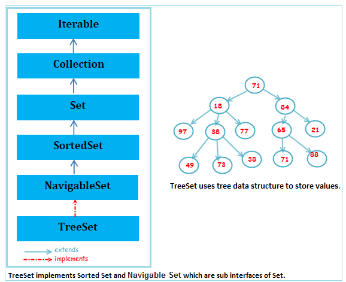

# Set interface 

Set содержит только уникальные элементы

# HashSet

Класс Java HashSet используется для создания коллекции, которая использует для хранения хеш-таблицу. Он наследует класс AbstractSet и реализует интерфейс Set.

Название Hash... происходит от понятия хэш-функция. Хэш-функция — это функция, сужающая множество значений объекта до некоторого подмножества целых чисел. Класс Object имеет метод hashCode(), который используется классом HashSet для эффективного размещения объектов, заносимых в коллекцию. В классах объектов, заносимых в HashSet, этот метод должен быть переопределен (override).


- HashSet хранит элементы, используя механизм, называемый хешированием.
- HashSet содержит только уникальные элементы.
- HashSet допускает нулевое значение.
- Класс HashSet не синхронизирован.
- HashSet не поддерживает порядок вставки. Здесь элементы вставляются на основе их хеш-кода.
- HashSet — лучший подход для операций поиска.
- Начальная емкость HashSet по умолчанию равна 16, а коэффициент загрузки — 0,75.

# LinkedHashSet

Класс Java LinkedHashSet представляет собой реализацию Hashtable и ***связанного списка интерфейса Set***. Он наследует класс HashSet и реализует интерфейс Set.

Класс LinkedHashSet расширяет класс HashSet, не добавляя никаких новых методов. Класс поддерживает связный список элементов набора в том порядке, в котором они вставлялись. Это позволяет организовать упорядоченную итерацию вставки в набор.

- Класс Java LinkedHashSet содержит только уникальные элементы, такие как HashSet.
- Класс Java LinkedHashSet предоставляет все дополнительные операции над наборами и допускает нулевые элементы.
- Класс Java LinkedHashSet не синхронизирован.
- Класс Java LinkedHashSet поддерживает порядок вставки.

# TreeSet (SortedSet)

Класс Java TreeSet реализует интерфейс Set, который использует дерево для хранения. Он наследует класс AbstractSet и реализует интерфейс NavigableSet. Объекты класса TreeSet хранятся в порядке возрастания.

TreeSet реализуется с использованием двоичного дерева поиска, которое самобалансируется, как красно-черное дерево. Таким образом, такие операции, как поиск, удаление и добавление, занимают время O(log(N)). Причина этого кроется в самобалансирующемся дереве. Это необходимо для того, чтобы высота дерева никогда не превышала O(log(N)) для всех упомянутых операций. Таким образом, это одна из эффективных структур данных, позволяющая хранить отсортированные большие данные, а также выполнять над ними операции.



- Класс Java TreeSet содержит только уникальные элементы, такие как HashSet.
- Время доступа и извлечения классов Java TreeSet очень быстрое.
- Класс Java TreeSet не допускает нулевой элемент.
- Класс Java TreeSet не синхронизирован.
- Класс Java TreeSet поддерживает возрастающий порядок.

Как уже говорилось выше, класс TreeSet не синхронизируется. Это означает, что если более одного потока одновременно обращаются к набору деревьев, и один из обращающихся потоков изменяет его, то синхронизацию необходимо выполнить вручную. Обычно это делается путем синхронизации объектов, инкапсулирующих набор. Однако в случае, когда такой объект не найден, набор необходимо обернуть с помощью метода Collections.synchronizedSet(). Рекомендуется использовать этот метод во время создания, чтобы избежать несинхронизированного доступа к набору. Следующий фрагмент кода показывает то же самое.

```java
TreeSet treeSet = new TreeSet();
Set syncrSet = Collections.synchronziedSet(treeSet); 
```
