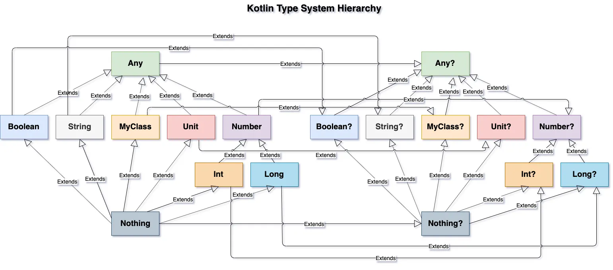

# Kotlin

<details>
<summary>В чем преимущества использования котлина?</summary>

Null-безопасность

Классы данных (Data Classes)

Sealed Classes

Object

Lateinit var

Coroutines

Inline fun / val

Функции-расширения

Умные приведения типов

В Kotlin необязательно явно указывать тип переменной
</details>

--------------------------------------------------------------------

<details>
<summary>Система типов</summary>

</details>

--------------------------------------------------------------------

<details>
<summary>Модификаторы доступа</summary>

В Kotlin модификаторы доступа позволяют управлять видимостью классов, функций и свойств, обеспечивая
инкапсуляцию и контроль доступа.
public — доступен везде и используется по умолчанию.
private — для сокрытия реализации внутри класса или файла.
protected — полезен при наследовании, доступен только в классе и его потомках.
internal — специфичный для Kotlin: ограничивает доступ границами модуля. Это удобно при создании SDK
или архитектурных слоёв, где нужно скрыть реализацию, но не делать её приватной.

Kotlin и Java имеют похожие, но не идентичные модификаторы доступа.
public, private, protected работают похоже, но protected в Kotlin более строгий — не виден вне
иерархии, даже в том же пакете.

Главные отличия:

- В Kotlin есть internal, которого нет в Java — он ограничивает доступ на уровне модуля, а не
  пакета. Java-код увидит internal как public.
- В Java есть package-private (без модификатора), которого нет в Kotlin. При работе с
  интероперабельностью стоит учитывать, что Java-код может получить доступ к
  Kotlin-элементам internal, потому что они транслируются в public на байткоде.

<h3>Почему нет package-private в Kotlin?<h3/>
Kotlin считает пакет — недостаточно надёжной единицей изоляции.
Аргументация JetBrains: Пакет — это просто пространство имён, не модуль, в больших проектах разные
команды могут писать код в одном пакете → легко нарушить границы. Вместо этого — модуль и internal

</details>

--------------------------------------------------------------------

<details>
<summary>Что такое Generics</summary>
Как и в Java, в Kotlin классы могут иметь типовые параметры

```kotlin
class Box<T>(t: T) {
    var value = t
}
```

Для того, чтобы создать объект такого класса, необходимо предоставить тип в качестве аргумента

Обобщённые ограничения

Набор всех возможных типов, которые могут быть переданы в качестве параметра, может быть ограничен с
помощью обобщённых ограничений.

Самый распространённый тип ограничений - верхняя граница, которая соответствует ключевому слову
extends из Java.

```kotlin
fun <T : Comparable<T>> sort(list: List<T>) {
    ...
}
```

Проверки безопасности типов, выполняемые Kotlin для использования общих объявлений, выполняются во
время компиляции. Во время выполнения экземпляры общих типов не содержат никакой информации об их
фактических аргументах типа. Говорят, информация о типе будет удалена. Например, экземпляры Foo<Bar>
и Foo<Baz?> удаляются до Foo<*>.

Поэтому нет общего способа проверить, был ли создан экземпляр общего типа с определенными
аргументами типа во время выполнения, и компилятор запрещает такие is-проверки.
[статья](https://kotlinlang.ru/docs/reference/generics.html)
</details>

<details>
<summary>Что такое inline функция</summary>
Использование функций высшего порядка влечёт за собой снижение производительности: во-первых, любая функция является объектом, а во-вторых, происходит захват контекста замыканием, то есть функции становятся доступны переменные, объявленные вне её тела. А выделения памяти (как для объекта функции, так и для её класса) и виртуальные вызовы занимают системные ресурсы.

Но во многих случаях эти дополнительные затраты можно устранить с помощью инлайнинга (встраивания)
лямбда-выражений.

Если функция помечена ключевым словом inline, то при компиляции код написаный в ней будет встроен в
место ее использования.
</details>

<details>
<summary>Ключевое слово reified</summary>

```kotlin
inline fun <reified T> myGenericFun()
```

Ключевое слово reified может быть использовано только с инлайн функцией.

Когда вы вызываете инлайн функции с ключевым словом reified, компилятор знает, для какого именно
класса она вызывается, что дает нам возможность внутри функции обращаться к генерику, как к классу

например

```kotlin
inline fun <reified T : Any> String.toKotlinObject(): T {
    val mapper = jacksonObjectMapper()
    return mapper.readValue(this, T::class.java)
}
```

без ключевого слова reified обращение к `T::class.java` вызовет ошибку

</details>

--------------------------------------------------------------------

<details>
<summary>Что такое Extensions(Расширение)</summary>
Kotlin позволяет расширять класс путём добавления нового функционала без необходимости наследования от такого класса и использования паттернов, таких как Decorator. Это реализовано с помощью специальных выражений, называемых расширениями.

Например, вы можете написать новые функции для класса из сторонней библиотеки, которую вы не можете
изменить. Такие функции можно вызывать обычным способом, как если бы они были методами исходного
класса. Этот механизм называется функцией расширения. В функции-расширении разрешено напрямую
обращаться к методам и свойствам расширяемого класса (кроме закрытых или защищённых свойств или
методов). Функцию-расширение нельзя переопределить в подклассах (наследниках). Существуют также
свойства расширения, которые позволяют определять новые свойства для существующих классов.

```kotlin
fun MutableList<Int>.swap(index1: Int, index2: Int) {
    val tmp = this[index1] // 'this' даёт ссылку на список
    this[index1] = this[index2]
    this[index2] = tmp
}
```

На самом деле это не настоящий метод у класса. Компилятор генерирует статическую функцию, где this —
это аргумент. Поэтому private, protected члены внутри расширяемого класса — недоступны.

</details>

<details>
<summary>Что такое делегаты</summary>
Делегированные свойства позволяют делегировать получение или присвоение их значения во вне - другому классу. Это позволяет нам добавить некоторую дополнительную логику при операции со свойствами, например, логгирование, какую-то предобработку и т.д.

Формальный синтаксис делегированного свойства:

```kotlin
var имя_свойства: тип_данных by выражение
```

После типа данных свойства идет ключевое слово by, после которого указывается выражение. Выражение
представляет класс, который условно называется делегатом. Делегаты свойств могут не применять
никаких интерфейсов, однако они должны предоставлять функции getValue() и setValue(). А выполнение
методов доступа get() и set(), которые есть у свойства, делегируется функциям getValue() и
setValue() класса делегата.

Стоит отметить, что мы не можем объявлять делегированные свойства в первичном конструкторе
</details>

<details>
<summary>Что такое Inner class</summary>
Класс, отмеченный как внутренний с помощью слова inner, может иметь доступ к членам внешнего класса. Внутренние классы содержат ссылку на объект внешнего класса.

```kotlin
class Outer {
    private val bar: Int = 1

    inner class Inner {
        fun foo() = bar
    }
}

val demo = Outer().Inner().foo()
```

Экземпляры анонимного внутреннего класса создаются с помощью объектов-выражений

```kotlin
window.addMouseListener(object : MouseAdapter() {

    override fun mouseClicked(e: MouseEvent) {
        ...
    }

    override fun mouseEntered(e: MouseEvent) {
        ...
    }
})
```

</details>

<details>
<summary>Что такое primary и secondary конструкторы?</summary>

Первичный конструктор является частью заголовка класса и определяется сразу после имени класса:

```kotlin
class Person constructor(_name: String) {

}
```

Класс также может определять вторичные конструкторы. Они применяются в основном, чтобы определить
дополнительные параметры, через которые можно передавать данные для инициализации объекта.

Вторичные конструкторы определяются в теле класса. Если для класса определен первичный конструктор,
то вторичный конструктор должен вызывать первичный с помощью ключевого слова this:

```kotlin 
class Person(_name: String) {
    val name: String = _name
    var age: Int = 0

    constructor(_name: String, _age: Int) : this(_name) {
        age = _age
    }
}
```

Здесь в классе Person определен первичный конструктор, который принимает значение для установки
свойства name.

И также добавлен вторичный конструктор. Он принимает два параметра: _name и _age. С помощью
ключевого слова this вызывается первичный конструктор, поэтому через этот вызов необходимо передать
значения для параметров первичного конструктора. В частности, в первичный конструктор передается
значение параметра _name. В самом вторичном конструкторе устанавливается значение свойства age.

```kotlin
constructor(_name: String, _age: Int) : this(_name) {
    age = _age
}
```

Таким образом, при вызове вторичного конструктора вначале вызывается первичный конструктор,
срабатывает блок инициализатора, который устанавливает свойство name. Затем выполняются собственно
действия вторичного конструктора, который устанавливает свойство age.
</details>

<details>
<summary>Какие Flow бывают в котлине?</summary>
StateFlow, MutableStateFlow, ShareFlow, MutableShareFlow

StateFlow имеет две разновидности: StateFlow и MutableStateFlow. MutableStateFlow является
наследником StateFlow и позволяет изменять хранящиеся в нем значение

Состояние представлено значением. Любое изменение значения будет отражено во всех коллекторах потока
путем выдачи значения с изменениями состояния.

```kotlin 
public interface StateFlow<out T> : SharedFlow<T> {
    public val value: T
}

public interface MutableStateFlow<out T> : StateFlow<T>, MutableSharedFlow<T> {
    public override var value: T
    public fun compareAndSet(expect: T, update: T): Boolean
}
```

SharedFlow - этот API-интерфейс подходит для обработки ряда выдаваемых значений, например для
вычисления скользящего среднего из потока данных.

```kotlin 
public interface SharedFlow<out T> : Flow<T> {
    public val replayCache: List<T>
}
```

Общий поток — это просто поток, где есть кэш повтора, который можно использовать в качестве
атомарного моментального снимка. Каждый новый подписчик сначала получает значения из кэша повтора, а
затем получает новые выданные значения. Вместе с SharedFlow мы также предоставляется
MutableSharedFlow.

```kotlin
interface MutableSharedFlow<T> : SharedFlow<T>, FlowCollector<T> {
    suspend fun emit(value: T)
    fun tryEmit(value: T): Boolean
    val subscriptionCount: StateFlow<Int>
    fun resetReplayCache()
}
```

С помощью MutableSharedFlow можно выдавать значения из приостанавливающего и неприостанавливающего
контекста. Как можно заключить из имени, кэш повтора MutableSharedFlow можно сбрасывать. Кроме того,
он предоставляет количество своих коллекторов как поток.
</details>

<details>
<summary>Какой поток горячий: SharedFlow или StateFlow?</summary>
Вопрос с подковыркой. Они оба - горячие

Холодные потоки генерируют события только при наличии подписчиков, горячие потоки могут генерировать
новые события, даже если на них не реагируют никакие подписчики.

[Доки](https://developer.android.com/kotlin/flow/stateflow-and-sharedflow)
</details>

<details>
<summary>Обычные (классические) классы (class)</summary>
Возможности:
- Можно создавать экземпляры.
- Поддерживают наследование (если не final).
- Могут содержать поля, методы, конструкторы, init блоки, companion object, вложенные и внутренние классы.

```kotlin
open class Animal(val name: String) {
    fun speak() = println("$name makes a sound")
}
```

Ограничения:

- Без open класс не может быть унаследован.
- Без open методы не переопределяются.

```kotlin
class Dog(name: String) : Animal(name) {
    fun bark() = println("$name says woof")
}
```

</details>

--------------------------------------------------------------------

<details>
<summary>Абстрактные классы (abstract class)</summary>
Возможности:
- Могут содержать как реализованные, так и абстрактные члены (без реализации).
- Нельзя создать экземпляр напрямую.
- Используются как базовые классы.

```kotlin
abstract class Shape {
    abstract fun area(): Double
}

class Circle(val radius: Double) : Shape() {
    override fun area() = Math.PI * radius * radius
}
```

Ограничения:

- Не создаются напрямую.
- Должен быть реализован весь абстрактный функционал в подклассах.

</details>

<details>
<summary>Интерфейсы (interface)</summary>
Возможности:
- Могут содержать абстрактные методы и методы с реализацией.
- Поддерживают множественное наследование.
- Могут содержать свойства (с геттерами/сеттерами).

```kotlin
interface Clickable {
    fun click()
    fun showOff() = println("I'm clickable!")
}

class Button : Clickable {
    override fun click() = println("Button clicked")
}
```

Ограничения:

- Не имеют состояния (полей), кроме val/var с кастомными геттерами.
- Нельзя хранить поля.

</details>

<details>
<summary>Анонимные классы (object : Type {})</summary>
Возможности:
- Создание класса на месте, без явного имени.
- Удобно для одноразовой логики, например, колбэков.

```kotlin
val listener = object : Clickable {
    override fun click() = println("Anonymous click")
}
```

Ограничения:

- Нельзя создать более одного экземпляра.
- Нельзя использовать вне своей области.

</details>

<details>
<summary>Data классы (data class)</summary>
Возможности:
- Автоматически генерируются: equals(), hashCode(), toString(), copy(), componentN().
- Удобны для хранения данных (DTO, модели).

```kotlin
data class User(val name: String, val age: Int)

val u1 = User("Alice", 30)
val u2 = u1.copy(age = 31)
```

Ограничения:

- Все параметры конструктора должны быть val или var.
- Не поддерживают abstract, open, sealed, inner.

</details>

<details>
<summary>Sealed классы (sealed class)</summary>
Возможности:
- Ограниченный контроль над наследованием (все подклассы — в одном файле).
- Используются с when без else.

```kotlin
sealed class Result
data class Success(val data: String) : Result()
data class Error(val message: String) : Result()

fun handle(result: Result) = when (result) {
    is Success -> println("Success: ${result.data}")
    is Error -> println("Error: ${result.message}")
}
```

Ограничения:

- Подклассы должны быть в том же файле.
- Нельзя создать экземпляр базового sealed class.

</details>

<details>
<summary>Sealed интерфейсы (sealed interface) — с Kotlin 1.5+</summary>
Возможности:
- Как sealed class, но могут быть реализованы классами и интерфейсами.
- Используются в тех же кейсах, что и sealed class, но более гибкие.

```kotlin
sealed interface UiState
data class Loading(val message: String) : UiState
object Idle : UiState
```

</details>

<details>
<summary>Таблица стравнения классов и ...</summary>

| Тип                  | Наследование       | Экземпляры | Основное применение                |
|----------------------|--------------------|------------|------------------------------------|
| `class`              | Да (если `open`)   | Да         | Общая логика                       |
| `abstract class`     | Да                 | Нет        | Базовые классы                     |
| `interface`          | Множественное      | Нет        | Контракты                          |
| `object :` (аноним.) | Нет                | Да (1 раз) | Анонимные объекты                  |
| `data class`         | Да                 | Да         | DTO, модели данных                 |
| `sealed class`       | Да (в одном файле) | Нет (база) | ADT, контроль состояний            |
| `sealed interface`   | Да (в одном файле) | Нет (база) | Гибкий ADT, реализация интерфейсов |

</details>

<details>
<summary>Sealed class и Sealed interface</summary>

sealed class и sealed interface — это оба способа создать ограниченную иерархию типов, когда мы
чётко знаем все допустимые подклассы на момент компиляции.

1. Базовый тип: класс vs интерфейс

- sealed class — это класс, и значит, он может содержать общую реализацию, состояние (val/var),
  методы.
- sealed interface — интерфейс, не может содержать состояния, только сигнатуры и реализацию по
  умолчанию.

```kotlin
sealed class UiEvent {
    data class Click(val x: Int, val y: Int) : UiEvent()
    object Idle : UiEvent()

    fun log() = println("Logging UiEvent") // allowed
}

sealed interface UiState {
    object Loading : UiState
    object Success : UiState
    // fun log() {} // нельзя (нельзя содержать state)
}
```

2. Наследование

- Класс может наследовать только один sealed class.
- Интерфейс можно комбинировать с другими интерфейсами (множественное наследование).
  Это делает sealed interface более гибким в сложной иерархии.

```kotlin
interface Loggable
sealed interface Event : Loggable
```

4. Конструкторы и init

- sealed class может иметь конструктор и init блок.
- sealed interface — нет

5. Модификаторы совместимости

- sealed interface появился в Kotlin 1.5.
- В JVM-байткоде sealed class → abstract, sealed; sealed interface → компилируется в Java sealed
  interface (Java SE 17+), если включена поддержка.

| Особенность                   | `sealed class`                                  | `sealed interface`                                         |
|-------------------------------|-------------------------------------------------|------------------------------------------------------------|
| Наследование                  | Только от одного класса                         | Множественное (можно реализовать несколько)                |
| Конструктор                   | Может иметь конструктор                         | Не имеет конструктора                                      |
| Состояния (подтипы)           | Только классы                                   | Классы **и интерфейсы**                                    |
| Расположение подтипов         | В одном и том же `.kt` файле                    | В одном и том же `.kt` файле                               |
| Вложенность                   | Можно определять подклассы внутри               | Можно определять вложенные интерфейсы и классы             |
| Иерархия                      | Более строгая, ограниченная одним наследованием | Более гибкая, возможна сложная иерархия                    |
| Использование в `when`        | Полный контроль `when` без `else`               | Также поддерживает `when` без `else`                       |
| Возможность состояния-объекта | Да (`object`, `data class`)                     | Да                                                         |
| Где чаще применяется          | Модель состояний, sealed API                    | Модель состояний с множественным наследованием, plugin API |

</details>

<details>
<summary>Sealed vs enum</summary>

| Характеристика         | `enum`                        | `sealed class` / `sealed interface`          |
|------------------------|-------------------------------|----------------------------------------------|
| Кол-во вариантов       | Фиксированное                 | Фиксированное (в пределах одного файла)      |
| Наследование           | Нет                           | Да                                           |
| Поля и логика          | Ограниченные (на уровне enum) | Полноценные классы со своими полями/методами |
| Аргументы конструктора | Да, но один на все варианты   | Свои у каждого подкласса                     |
| Использование в `when` | Полный `exhaustiveness`       | Да, без `else`, если все обработаны          |
| Serialization          | Проста с `enum`               | Требует `sealed` + адаптер                   |
| Расширяемость          | Плохая (всё жёстко задано)    | Гибкая, но в пределах одного файла           |

<h3>enum</h3>
Использование:

- Для фиксированных значений без сложной логики.
- Когда значения не имеют иерархии.
- Отлично подходит для UI-состояний, ролей, простых статусов.

```kotlin
enum class UserRole {
    ADMIN,
    USER,
    GUEST
}
```

Можно добавить свойства и методы:

```kotlin
enum class State(val isActive: Boolean) {
    START(true),
    STOP(false);

    fun toggle(): State = if (this == START) STOP else START
}
```

Ограничения:

- Все варианты — экземпляры одного класса.
- Один конструктор на все значения.
- Не может быть разной логики в каждом значении (хак — использовать abstract fun, но это костыль).

<h3>sealed</h3>
Использование:

- Когда нужно представлять иерархию состояний.
- Когда каждый тип должен быть отдельным классом с разными полями и поведением.
- Например, работа с результатами API, стейт-машины, error handling.

```kotlin
sealed class Result {
    data class Success(val data: String) : Result()
    data class Error(val message: String) : Result()
    object Loading : Result()
}
```

Пример с when:

```kotlin
fun handle(result: Result) = when (result) {
    is Result.Success -> println(result.data)
    is Result.Error -> println("Error: ${result.message}")
    is Result.Loading -> println("Loading...")
}
```

Преимущества:

- Каждый подтип может иметь свои свойства и методы.
- Расширяемость (но в пределах одного файла).
- Легко использовать с when без else.

<h3>Итог сравнения</h3>
В enum я бы представил роли пользователя (ADMIN, USER, GUEST), потому что у них одинаковая
структура.
А если бы я моделировал результат API-запроса (успех, ошибка, загрузка), то выбрал бы sealed, потому
что каждому случаю нужно своё поведение и данные.

</details>

<details>
<summary>Interface vs Abstract классы</summary>

Интерфейсы — это контракты без состояния. Они идеальны, когда нужно описать поведение, которое может
быть реализовано разными классами (например, Serializable, Clickable).

Абстрактные классы — это частично реализованные классы с полями, конструкторами и общей логикой. Я
использую их, когда нужен базовый шаблон с разделяемым состоянием и поведением, например, в
UI-компонентах или бизнес-логике.

Главное отличие заключается в том, что интерфейс определяет только что должен делать класс, а
абстрактный класс может частично реализовывать как это делается.

- Оба используются для абстракции, определения общих API.
- Основное различие — в возможностях, ограничениях и применении.

| Характеристика                    | `interface`                                      | `abstract class`                          |
|-----------------------------------|--------------------------------------------------|-------------------------------------------|
| Наследование                      | Множественное                                    | Только одно                               |
| Конструктор                       | ❌ Нет                                            | ✅ Есть                                    |
| Поля (`val`/`var`)                | ✅ Только с кастомными геттерами/сеттерами        | ✅ Полноценные свойства                    |
| Методы с реализацией              | ✅ Да (с `default` реализацией)                   | ✅ Да                                      |
| Абстрактные методы                | ✅ Да                                             | ✅ Да                                      |
| Инициализация (`init`)            | ❌ Нет                                            | ✅ Да                                      |
| Переопределение `equals/hashCode` | ❌ Нет                                            | ✅ Да                                      |
| Использование                     | Контракты, API-интерфейсы, плагинные архитектуры | Общая логика и состояние в базовом классе |

Интерфейс (interface) в Kotlin может содержать абстрактные методы, свойства, а также методы с
реализацией (начиная с Java 8 и полностью в Kotlin это разрешено). Он не может хранить состояние (
переменные как поля), только свойства с геттерами/сеттерами. Интерфейсы позволяют множественное
наследование, что делает их удобными для описания аспектов поведения — например, Clickable,
Serializable, Loggable. Это хорошо подходит, когда классы могут наследовать поведение из разных
источников.

Абстрактный класс (abstract class) может содержать как абстрактные, так и конкретные методы, а также
состояние (поля, init блоки, конструкторы). Он используется, когда нужно задать общую логику и
данные для всех наследников. В отличие от интерфейсов, класс может наследовать только один
абстрактный класс, поэтому он применяется, когда у нас есть чёткая иерархия с сильной связью между
базовым и дочерними типами. Кроме того, абстрактный класс может быть полезен, когда нужно иметь
защищённые (protected) члены, чего нет в интерфейсах.

На практике я бы выбрал интерфейс, если мне нужно описать поведение, которое может быть добавлено к
любому классу, независимо от его иерархии. А абстрактный класс — если мне нужно предоставить базовую
реализацию, общее состояние и поведение для группы родственных классов.

Таким образом, выбор между интерфейсом и абстрактным классом зависит от контекста: интерфейс — для
описания контрактов поведения, абстрактный класс — для наследования с частичной реализацией и
состоянием.

</details>

--------------------------------------------------------------------